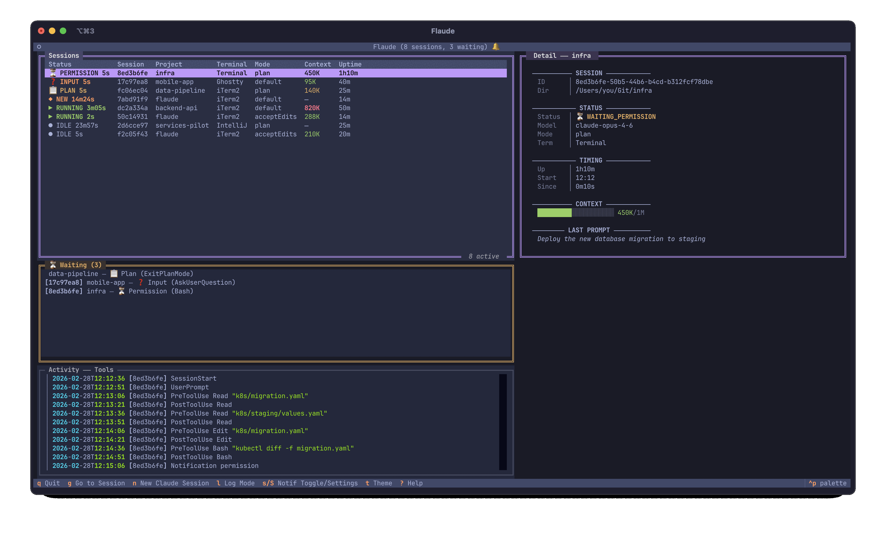

<p align="center">
  
</p>

## Flaude

A portmanteau of "flawed" and "Claude" — because anything that passes through me picks up a few imperfections along the way. Powered by Claude, it occasionally achieves flawlessness, but true to its namesake, flawed is the default setting.

A lightweight TUI dashboard for monitoring multiple concurrent Claude Code sessions. Powered by Claude Code's hook system — zero polling of Claude's internals, no process injection, no bloat. Hooks fire on session events, write a JSON file, and exit. The dashboard reads those files on a 1-second timer. That's it.

The hook dispatcher ships as a native Rust binary for fast invocation (~14ms vs ~250ms for Python). Falls back to Python automatically if Rust isn't available at build time.

<p align="center">
  
</p>

### Features

- **Live session dashboard** -- theme-aware status colors, context usage, uptime, and model info for all running sessions. Agent team members are visually nested under their parent session with tree connectors and agent names
- **Terminal navigation** -- jump to any session's terminal tab/window with a keypress. Full tab-level switching on iTerm2 (via TTY matching). Ghostty does window-level matching (raises the window containing the project name). Terminal.app matches by custom tab title. Warp and IntelliJ are limited to bringing the app to the foreground
- **Session launcher** -- start new Claude sessions from the dashboard with directory autocomplete
- **Send prompt** -- type a prompt in flaude and send it to an idle Claude session via iTerm2's AppleScript API. Supports multi-line input (Shift+Enter for new lines, Enter to send). iTerm2 only
- **Exit session** -- send `/exit` to an idle Claude session from the dashboard. Uses the same iTerm2 AppleScript injection as prompt sending, with a confirmation dialog. iTerm2 only
- **Notification system** -- two categories: long turn completion (alert when a turn finishes after N minutes) and waiting on input (alert when a session needs permission, an answer, or plan review). Supports terminal bell, macOS notifications, and system sounds. Off by default, toggle with `s`, configure with `S`. Title bar shows 🔔/🔕 indicator. Note: Claude Code's built-in notifications have a [known delay bug](https://github.com/anthropics/claude-code/issues/5186) — flaude's hook-based notifications fire immediately when the event occurs, no delay
- **Activity log** -- tail session transcripts in real time with three verbosity modes (All / Summary / Tools)
- **Session detail panel** -- sectioned view with session info, status, timing, context ratio, last prompt, pending questions with plan approval details, and team membership info for agent team members
- **Monitor-only hooks** -- never blocks Claude Code; users approve permissions in their own terminal as usual
- **Theme customization** -- all colors adapt to the selected Textual theme, with persistence across restarts
- **Ghost session cleanup** -- sessions inactive for 30s get a process check, 8-hour hard timeout. Idle sessions are soft-hidden from the dashboard after 30 minutes (configurable in settings) but not deleted. Cleanup only removes the session file from Flaude's dashboard, not the actual Claude session — it reappears automatically on next activity. Configurable via `FLAUDE_STALE_SESSION_TIMEOUT`

### Terminal support

**iTerm2 is strongly recommended.** It's the only terminal that exposes tab-level APIs, which flaude uses for precise session navigation — jump directly to the tab running a specific Claude session. Other terminals (Ghostty, Terminal.app, Warp, IntelliJ) are limited to bringing the app to the foreground; flaude can't switch to a specific tab within them.

### Install

Requires **Python 3.11+** and **macOS** (terminal navigation uses AppleScript).

For faster hooks (~18x), install [Rust](https://www.rust-lang.org/tools/install) first. If `cargo` is available during install, the native hook dispatcher is compiled automatically. Without it, a Python fallback is used — everything works, just slightly slower hook invocations.

```bash
# Optional: install Rust for the native hook dispatcher
curl --proto '=https' --tlsv1.2 -sSf https://sh.rustup.rs | sh

# Install flaude (compiles Rust binary if cargo is on PATH)
pip install git+https://github.com/architg25/flaude.git
flaude init
```

`flaude init` registers hooks in `~/.claude/settings.json` (backs up the file first) and tells you which dispatcher is being used.

### Usage

```
flaude                  # Launch the dashboard
flaude status           # Quick CLI status table (no TUI)
flaude init             # Install hooks into Claude Code
flaude init --dry-run   # Preview hook installation
flaude uninstall        # Remove hooks from Claude Code
flaude uninstall --purge # Remove config, state, and pip uninstall
flaude update           # Self-update to latest version
```

### Key bindings

| Key         | Action                                          |
| ----------- | ----------------------------------------------- |
| `Enter`/`g` | Navigate to the selected session's terminal     |
| `n`         | Launch a new Claude session (directory picker)  |
| `p`         | Send a prompt to the selected session (iTerm2)  |
| `d`         | Exit the selected session (iTerm2)              |
| `l`         | Cycle activity log mode (All / Summary / Tools) |
| `s`/`S`     | Toggle notifications / notification settings    |
| `t`         | Change theme (Textual theme picker with search) |
| `h`         | Toggle display of hidden/stale sessions         |
| `?`         | Help dialog                                     |
| `q`         | Quit                                            |

### Architecture

```
Hook events (stdin JSON)
        │
        ▼
  flaude-hook (Rust)      ← Native binary, ~14ms per invocation
  or dispatcher.py        ← Python fallback if Rust binary unavailable
        │
        ├─▶ state/<session>.json  ← Atomic write to /tmp/flaude/state/
        └─▶ logs/activity.log     ← Append one-line log entry

  tui/app.py              ← Polls state files every 1s, updates widgets
        │
        ├─▶ session_table.py     ← DataTable with status, context, mode columns
        ├─▶ session_detail.py    ← Right panel: full session info + pending questions
        ├─▶ permission_panel.py  ← Waiting sessions with question details
        └─▶ activity_log.py     ← Transcript viewer (All/Summary/Tools modes)
```

### Permission detection

Permission-waiting state is detected via Claude Code's `PermissionRequest` hook. Claude Code short-circuits the hook chain: if an earlier hook (e.g., a user's auto-approve hook) returns an allow/deny decision, subsequent hooks don't fire. Since flaude's handler is registered last (via `append()` in `flaude init`), it only runs when the tool actually goes to "ask" — no false positives.

**Ordering matters**: `flaude-hook` must be the LAST entry in the `PermissionRequest` hooks array. `flaude init` ensures this by appending. If you add custom `PermissionRequest` hooks, place them before flaude's entry.

### Requirements

- Python 3.11+
- macOS (terminal navigation uses AppleScript)
- [textual](https://github.com/Textualize/textual) >= 1.0.0
- [pydantic](https://github.com/pydantic/pydantic) >= 2.0
- [pyyaml](https://github.com/yaml/pyyaml) >= 6.0
- [setproctitle](https://github.com/dvarrazzo/py-setproctitle) >= 1.3
- **Optional:** [Rust](https://www.rust-lang.org/tools/install) toolchain — if `cargo` is on PATH at install time, the native hook dispatcher is compiled and bundled. Without it, the Python fallback is used transparently.

For detailed documentation on dashboard layout, terminals, notifications, configuration, and environment variables, see [docs/dashboard.md](docs/dashboard.md). Performance analysis of the Rust hook dispatcher is in [docs/rust-hook.md](docs/rust-hook.md). Known bugs are tracked in [docs/BUG.md](docs/BUG.md). Future plans are in [docs/TODO.md](docs/TODO.md).
